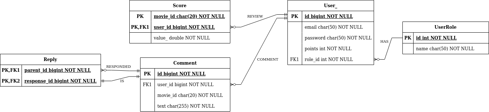

# Movies Review API
This project is a REST API for evaluating movies through ratings and comments, using the [IMDb API](http://www.omdbapi.com/). Evaluating actions (better described below) are controlled by authorization through user profiles authenticated via JWT.

## Authentication
Authentication is done via email and password by another service ([Movies Review Auth](https://github.com/gabrieloswaldo/movies-review-auth)), which must be running simultaneously. The authentication service will validate the user's email and password in the same database, then return a JWT token, which will be returned to the user and used later for endpoints authorization.

## User roles and permissions

The application has the following user roles with their respective permissions:

### Reader: 
After authenticated through log in, this user will be able to search for a movie to see it's information, and rate that movie.

### Basic:
After authenticated through log in, this user will the same permissions as the Reader role, and also be able to post and respond to comments about the movies.

### Advanced
After authenticated through log in, this user will the same permissions as the Basic role.

### Admin
After authenticated through log in, this user will the same permissions as the Basic role, and can also delete any comment.

## Entity Relationship Diagram

## API documentation
This is a summary of the application endpoints. They can be tested using [Postman](https://www.postman.com/) by importing the collection available into the `postman` directory at the project root.

### POST - `http://localhost:8080/api/v1/auth/login`
Authenticate user.

### GET - `http://localhost:8080/api/v1/movies/<movie-name>`
Return a movie from IMDb API.

### POST - `http://localhost:8080/api/v1/comments`
Post a comment to a movie.

### DELETE - `http://localhost:8080/api/v1/comments/<comment-id>`
Delete a comment by its id.

### POST - `http://localhost:8080/api/v1/replies`
Post a comment reply to another comment.

### POST - `http://localhost:8080/api/v1/scores`
Rate a movie.

## Execution

### Prerequisites
- Java 11
- Docker and docker-compose

### Step by step
Follow this step by step to run the application (start at the project root directory):
- Clone this project;
- Import it as a Maven project into your IDE;
- Run the database container with `cd db && docker-compose up`
- Populate the database with the `src/main/resources/data.sql` script (for database seeding);
- Run the authentication service ([Movies Review Auth](https://github.com/gabrieloswaldo/movies-review-auth) - see documentation);
- Run the _MoviesReviewApiApplication_ class.

## Features to be implemented
Finally, some features were not implemented and may be added in the future:
- Add API Swagger documentation;
- Create a sign up endpoint;
- Create a points system for users when rating movies, commenting or replying to comments, which will allow them to acquire new roles;
- Create new features for each role, such as:
  - _Advanced_, _Admin_: quote other comments (comments made by other users) and mark comments as “liked” or “disliked”;
  - _Admin_: mark a comment as repeated and make another user admin.
- Add caching.
